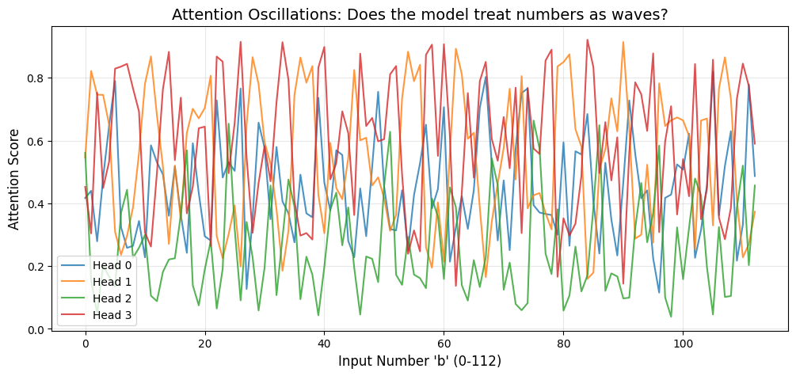
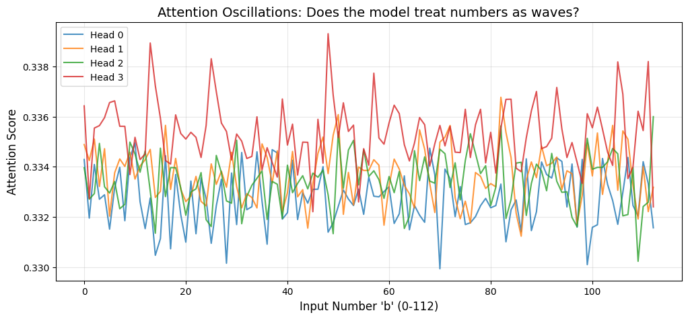

Most of the time when we train a model, we usually expect the model to learn the task at hand and generalize well on it. However, there are chances of overfitting where either the model complexity is too high for the amount of data at hand or a variety of other factors that prevent the model from generalizing well. 

We assume that once a model starts overfitting, it will only continue to overfit even more and not return to generalizing. However, this is not always the case. [Power et al. (2022)](https://arxiv.org/abs/2201.02177) shows that a model can in fact, start to generalize very quickly after a period of overfitting.

# What is Grokking?

Grokking is the phenomenon where a model starts to rapidly generalize after an arbitrary amount of overfitting depending on the task that it is being trained on. In this blog, I will show the findings of the demonstration of this phenomenon.

There are some factors to consider why Grokking occurs in general. Usually the model just overfits and doesn't actually converge to a good solution. To make sure that we observe it, we tune this hyperparameter weight decay in the optimizer that we use. Weight decay is a regularization technique that adds a penalty to the loss function based on the magnitude of the weights present in the model. So bigger the weights, higher the penalty and the model is forced to learn a simpler and generalizable solution. 

This is important because bigger weights to certain neurons essentiall means that the model is giving high priority to certain "patterns" that that neuron is looking for, which makes the model very brittle since in case it comes across a data instance which doesn't contain that pattern but is still valid, the model can break.

# Experimental Setup

To demonstrate this phenomenon, we will be training a transformer model on predicting the output to modular addition ``` (a + b) mod 113 ``` of two numbers. We will generate a dataset for this keeping the prime number modular value as 113. Why use prime numbers? Well, it is because if we use any non-prime number, there can be some patterns that the model can learn which isn't modular addition. For example, if we use 32 as the modular number, the model can learn something related to the factors of it like 2, 4, 8, 16, 32. Using prime numbers minimizes the chances of this happening. We will train the model with very few data instances to ensure that it overfits. In this demonstration, I did a 30:70 train-test split, which ensures that the model has just enough to learn the task eventually but not enough to generalize quickly at the start.

We will be using a transformer model with the following hyperparameters:

```python
class GrokkingConfig:
    # Model architecture
    n_layers: int = 1
    d_model: int = 128
    n_heads: int = 4
    d_head: int = 32
    n_ctx: int = 3
    d_vocab: int = 114
    act_fn: str = 'relu'
    normalization_type: Optional[str] = None
    
    # Training hyperparameters
    seed: int = 999
    prime_P: int = 113
    num_epochs: int = 20000
    lr: float = 0.001
    weight_decay: float = 1.0
    batch_size_ratio: float = 0.30
    
    # Early stopping
    target_val_acc: float = 0.975
```

# Training

We train this model using an arbitrary number of epochs until we obtain rapid generalization, we will check for this using early stopping, by stopping the training once the model obtains a validation accuracy of 97.5%.

> Epoch: 499, Train Loss: 0.016067981719970703, Train Acc: 1.0, Val Acc: 0.011634411290287971
>
> Epoch: 999, Train Loss: 0.008425424806773663, Train Acc: 1.0, Val Acc: 0.012753104791045189
>
> Epoch: 1499, Train Loss: 0.005271475296467543, Train Acc: 1.0, Val Acc: 0.014990491792559624
>
> Epoch: 1999, Train Loss: 0.0035275653935968876, Train Acc: 1.0, Val Acc: 0.016780400648713112
>
> Epoch: 2499, Train Loss: 0.002459954237565398, Train Acc: 1.0, Val Acc: 0.01924152672290802
>
> Epoch: 2999, Train Loss: 0.0017567952163517475, Train Acc: 1.0, Val Acc: 0.022038260474801064
>
> Epoch: 3499, Train Loss: 0.0012750866590067744, Train Acc: 1.0, Val Acc: 0.02505873143672943
>
> Epoch: 3999, Train Loss: 0.0009343863930553198, Train Acc: 1.0, Val Acc: 0.030652198940515518
>
> Epoch: 4499, Train Loss: 0.0006907582865096629, Train Acc: 1.0, Val Acc: 0.040832310914993286
>
> Epoch: 4999, Train Loss: 0.0005101371789351106, Train Acc: 1.0, Val Acc: 0.05571093037724495
>
> Epoch: 5499, Train Loss: 0.000376334588509053, Train Acc: 1.0, Val Acc: 0.07875601202249527
>
> Epoch: 5999, Train Loss: 0.00027723604580387473, Train Acc: 1.0, Val Acc: 0.1124286875128746
>
> Epoch: 6499, Train Loss: 0.00020369331468828022, Train Acc: 1.0, Val Acc: 0.1675802767276764
>
> Epoch: 6999, Train Loss: 0.00014836782065685838, Train Acc: 1.0, Val Acc: 0.25964874029159546
>
> Epoch: 7499, Train Loss: 0.00010402609768789262, Train Acc: 1.0, Val Acc: 0.4201812446117401
>
> Epoch: 7999, Train Loss: 6.873613892821595e-05, Train Acc: 1.0, Val Acc: 0.7335272431373596
>
> Epoch: 8499, Train Loss: 3.966569420299493e-05, Train Acc: 1.0, Val Acc: 0.9671104550361633
>
> Epoch: 8999, Train Loss: 2.592383862065617e-05, Train Acc: 1.0, Val Acc: 0.9969795346260071

This snippet is a full training run of the model. We can observe that the model initially starts to overfit very quickly and then after around Epoch 7000, the validation accuracy starts to increase very rapidly after a period of overfitting. This is the grokking phenomenon.

# Analysis

After training the model and observing that the model has generalized, we need to prove that the model actually has learnt the right task and hasn't simply exploited some random spurious patterns in the data.

To do this, we will check the ``` W_E ``` weights of the model and check if the model has learnt the right task. To verify this, we use Fast Fourier Transform (FFT) to check on this embedding matrix.


Here we plot a graph of the each embedding dimension across the vocabulary of the model in the y-axis and the range of frequencies in the x-axis. We can observe that there are certain frequencies that the value of each dimension is high for. This means that the values of the embedding matrix dimensions are oscillating at a certain frequencies! This basically means that the model has learnt that a combination of cosine and sine waves are representative of the data.

Each number can be represented in terms of cos and sin waves using this formula,

``` 
cos(x)sin(x) 
```

which represents the number in terms of angles instead of only its value. This shows that the model has learnt that the value of the number oscillate after a certain point which is true in modular addition.

For example, this is a graph of the exact same model but untrained:


Here we can see that the model has not really learn any kind of specific pattern in the embedding matrix and the frequencies are all scattered out.

To show that, model's attention heads also have learnt how to use the embeddings to actually predict the right output, we plot a graph of the attention scores against the ```b``` token of the input sequence keeping the ```a``` token fixed. This helps us visualize how the attention heads treat the input for a varying range of ```b``` values.



We can see here that the even the different attention heads of the model are also oscillating at a certain frequency! This implies that the model is in fact performing a dot product between the input tokens and which results in this pattern of varying attention scores.

You might ask, how exactly can a model compute modular addition using only dot products? Well, there is a certain trigonometric identity that this model found and is exploiting to compute modular addition.

``` 
cos(a+b) = cos(a)cos(b) - sin(a)sin(b)
```

But, the model does dot products which means it has to add them and not subtract this. So, the model internally converts the ```b``` value to ```-b``` and then uses this identity to compute the modular addition.

``` 
cos(a-b) = cos(a)cos(b) + sin(a)sin(b)
Result  = cos(a-(-b))
Result  = cos(a+b) 
```

For reference, here's the same plot with an untrained model:



This discovery shows that the model has found a way to compute modular addition using just the dot products of the input tokens.

# References

[1] Power et al. (2022) - [Grokking: Generalization Beyond Overfitting on Small Algorithmic Datasets](https://arxiv.org/abs/2201.02177). The original paper identifying the phase transition.

[2] Nanda et al. (2023) - [Progress Measures for Grokking via Mechanistic Interpretability](https://arxiv.org/abs/2301.05217). The paper that reverse-engineered the modular addition algorithm, which I replicated here.

[3] Elhage et al. (2021) - [A Mathematical Framework for Transformer Circuits](https://transformer-circuits.pub/2021/framework/index.html). Foundational work on analyzing transformer weights.

[4] TransformerLens - The library used for all activation patching and Fourier analysis in this project.