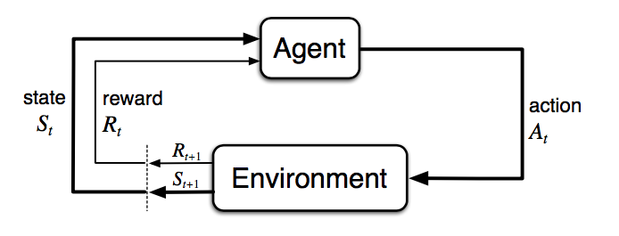
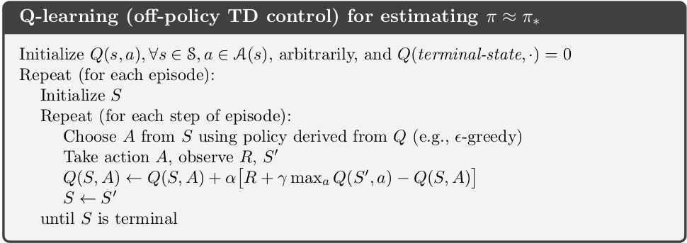

 
 A lot of exciting stuff has happened in the world of Artificial Intelligence recently, and a lot of brilliant new ideas and technologies have emerged as a result of that with many core technologies being explored extensively. However, the art of fine-tuning these models to cater to human needs and how AI can be used to learn about strategies and patterns without any human data is a very beautiful area of its own. In this post, I will be briefly covering this exciting and wonderful field.

## What is Reinforcement Learning?

Reinforcement Learning can be described as a field of Artificial Intelligence that deals with the science of decision making. It takes a unique approach where there is no supervisor to explicitly mention what's right or what's wrong. Instead, there is a reward signal which conveys that message. The feedback here is delayed and not instantaneous as observed with other areas of Machine Learning.

 *Figure 1: The agent-environment interaction in a Markov Decision Process (Image source: Sec. 3.1 Sutton & Barto (2017).)*

Here, there is an agent that takes an action in an environment and receives a reward and a new state which is a result of the action that it took. The agent is tasked to maximise the reward that it can receive by adapting to the environment.

## The RL Problem

The environment is initially unknown since the agent is just dropped into the environment. The agent then interacts with and explores the environment to gain more information about it. As it finds out the different techniques and methods it can use to get more rewards, it improves its policy.

A bunch of terms have been introduced now, let's get into all of them slowly. A reward $R_t$ is a scalar feedback signal received after taking action $A_t$ from state $S_t$ which is indicative of how well an agent is doing at any time $t$ and the agent is tasked to maximise the cumulative reward.

### What is the goal here?

The agent is supposed to take actions such that it can maximise the reward from the environment it is interacting with. However, we should also take into consideration that certain actions can have long term effects whose rewards may not be seen immediately but at a much later stage in its run in the environment, implying that rewards can be delayed too.

At each time step $t$, the agent:
- Executes an Action
- Receives observation
- Receives a scalar reward

And at each time step $t$, the environment:
- Receives an action
- Emits an observation
- Emits a scalar reward

The History, is a sequence of observations, actions and rewards:

$$H_t = A_1, O_1, R_1, ..., A_t, O_t, R_t$$

What happens next is a factor of the history, where the agent picks actions and the environment picks observations and rewards.

### State

A state is the information that is used to determine what normally happens next in the environment. This can also be divided into an Environment State, which is the environment's private state and an Agent State, which is the agent's internal representation, which is the info that is used by RL algorithms. There is also an Information state, also called a Markov State, which contains all the useful information from history.

## Key Concepts

The taxonomy of almost any RL Algorithm can be divided into a bunch of components.

The agent is placed in a fresh environment, however, this agent initially does not know anything about this environment that it is dropped into. It can make certain assessments based on a model of the environment which we may or may not have information about. The agent can transition between states ($s \in S$) by taking specific actions ($a \in A$). Which state the agent will arrive in depends on the transition probability function. Once an action is taken, the agent will receive a scalar reward ($r \in R$) as feedback.

The different categories of RL algorithms that you can come across quite a bit:

- **Model-based**: The agent has access to a model of the environment which it can use to make informed decisions with respect to its actions by planning ahead. This is similar to how a chess player picks their moves by predicting how their opponent would move, they would have an internal model of how the environment is.

- **Model-free**: The agent does not depend on the model. This is analogous to learning how to ride a bike, we wouldn't know the physics model of how a bike works exactly, but we just learn from experience by riding it.

- **On-Policy**: Use the deterministic outcomes or samples from target policy to train the algorithm. It learns from the actions it currently takes.

- **Off-Policy**: Training on a distribution of transitions or episodes produced by a different behaviour policy than that produced by the target policy. It can learn its policy by watching another agent do its actions.

### Policy

This constitutes the behaviour function of the RL Algorithm, it defines how the agent takes actions in the environment. We can call it the decision-making body of the RL Agent. The policy maps the possible states to the possible actions.

**Deterministic**: $\pi(s) = a$

**Stochastic**: $\pi(a|s) = P[A=a|S=s]$

### Value

It is a function that essentially evaluates the goodness or the badness of states. It can also serve as a function that can give a prediction of future rewards $G_t$, which is a discounted sum of the rewards going forward with respect to a particular policy.

$$v_\pi(s) = E_\pi[R_{t+1} + \gamma \cdot R_{t+2} + \gamma^2 \cdot R_{t+3} + ... | S_t=s]$$

$$G_t = R_{t+1} + \gamma \cdot R_{t+2} + \gamma^2 \cdot R_{t+3} + ...$$

$$v_\pi(s) = E_\pi[G_t | S_t=s]$$

### Model

A Model is a descriptor of the environment. It predicts what the environment will do. With the model, we can infer how the environment would interact with and provide feedback to the agent. The model has two major parts, the transition probability function $P_{ss'}$ and the reward function $R$.

The transition probability function gives a probability distribution of the possible next states given a particular state and action from that state.

$$P_{ss'} = P[S' = s' | S = s, A = a]$$

The reward function gives the expectation of the rewards given a particular state and action.

$$R_{sa} = E[R | S=s, A=a]$$

  
*Figure 2: Summary of approaches in RL (Image source: reproduced from David Silver's RL course lecture 1.)*

### Optimal Value and Policy

The optimal value produces the maximum return:

$$v_*(s) = \max_\pi v_\pi(s)$$

$$q_*(s,a) = \max_\pi q_\pi(s,a)$$

The optimal policy achieves optimal value functions:

$$\pi\_{\*}(s) = \arg\max_a q\_{\*}(s,a)$$

## Markov Decision Process

In formal terms, almost any RL Problem can be framed as a Markov Decision Process (MDP). It is used to describe an environment for RL. In this scenario, the environment is fully observable.

MDPs use the Markov Property, which states that the action of an agent is only dependent on its current state and not its history. The agent in an MDP does not have to take into consideration all its previous states and actions to make a decision on which state to take but rather it can take that decision with just the information of its current state.

$$P[S_{t+1}|S_t, A_t] = P[S_{t+1}|S_1, A_1,...,S_t, A_t]$$

A Markov Decision Process has the following values $\langle S, A, P, R, \gamma \rangle$ where

- $S$ - State
- $A$ - Action
- $P$ - state transition probability matrix
- $R$ - reward function $R_s$
- $\gamma$ - discount factor so that recent states can get more weight relative to older states

  
*Figure 3: An example of a Markov Decision Process: a typical workday (Image source: randomant.net/reinforcement-learning-concepts)*

## Bellman Equations

The Bellman Equations refer to a set of equations that decompose the value function, $V(s) = E[G_t | S_t = s]$ into:

- The immediate reward $R_{t+1}$
- Discounted value of successor state $\gamma \cdot v(S_{t+1})$

$$V(s) = E[R_{t+1} + \gamma \cdot V(S_{t+1}) | S_t = s]$$

### Bellman Expectation Equations

  
*Figure 4: Illustration of how a Bellman Expectation Equation updates the state-value or action-value functions. (Image source: reproduced from David Silver's UCL Course lecture 2.)*

We can take this example where there is a node referring to a state-action value, which has a certain probability of taking $s'$ state, we can use a recursive method to approximate the value of the function $q_\pi(s,a)$ for that state $s$ and action $a$ in the diagram.

$$v_\pi(s) = \sum_a \pi(a|s) q_\pi(s,a)$$

$$q_\pi(s,a) = R_s^a + \gamma \sum_{s'} P_{ss'}^a v_\pi(s')$$

$$v_\pi(s) = \sum_a \pi(a|s) \left( R_s^a + \gamma \sum_{s'} P_{ss'}^a v_\pi(s') \right)$$

$$q_\pi(s,a) = R_s^a + \gamma \sum_{s'} P_{ss'}^a \sum_{a'} \pi(a'|s') q_\pi(s',a')$$

### Bellman Optimality Equations

If we want to find out the optimal values for the value or state-action value functions, we can use the Bellman Optimality Equations:

$$v\_{\*}(s) = \operatorname{max}_a q\_{\*}(s,a)$$

$$q\_{\*}(s,a) = R_s^a + \gamma \sum_{s'} P_{ss'}^a v\_{\*}(s')$$

$$v\_{\*}(s) = \operatorname{max}_a \left( R_s^a + \gamma \sum_{s'} P_{ss'}^a v\_{\*}(s') \right)$$

$$q\_{\*}(s,a) = R_s^a + \gamma \sum_{s'} P_{ss'}^a \operatorname{max}_{a'} q\_{\*}(s',a')$$

## Common Approaches

Now, let us go through some major approaches and classical algorithms to solve RL problems.

### Dynamic Programming

Using Dynamic Programming allows us to break complex problems into sub-parts that can be easily solved, joining which gives us the overall solution. Dynamic Programming assumes full knowledge of the MDP.

#### Policy Evaluation

In policy evaluation we try to approximate the value function, given a certain policy $\pi$. We can do this using a Bellman backup using a one-step lookahead in the state transition tree.

$$V_{k+1}(s) = \sum_a \pi(a | s) \left[ R_s^a + \gamma \sum_{s'} P_{ss'}^a V_k(s') \right]$$

#### Policy Improvement

In policy improvement, we try to improve the policy by acting greedily with respect to $V_\pi$.

$$\pi'(s) = \arg\max_a q_\pi(s, a)$$

$$q_\pi(s, \pi'(s)) = \max_a q_\pi(s, a) \geq q_\pi(s, \pi(s))$$

Which implies that if we use the greedy approach to choose our action to the next state, then the value will be equal to or greater than the value of that state-action value if we act with our policy.

#### Policy Iteration

Using policy iteration, we iteratively evaluate and improve our value function such that eventually the value function converges at the optimal value function.

$$\pi_1 \rightarrow V_1 \rightarrow \pi_2 \rightarrow V_2 \rightarrow \pi_3 \rightarrow V_3 \rightarrow ... \rightarrow \pi_* \rightarrow V_*$$

### Monte-Carlo Methods

The Monte-Carlo methods are a family of algorithms which learns directly from episodes of experience without any knowledge of the MDP transitions or rewards. It learns from complete episodes without any bootstrapping, which means that the environment has to be of terminating nature and will not work as intended in a non-terminating environment.

$$G_t = R_{t+1} + \gamma \cdot R_{t+2} + ... + \gamma^{T-1} \cdot R_T$$

$$V_\pi(s) = E_\pi[G_t | S_t = s]$$

As you can observe, we are exploring the environment through complete episodes and then the value function gets the empirical mean return.

### Temporal-Difference Learning

Similar to Monte-Carlo methods, Temporal-Difference is model-free and learns from episodes of experience. However, TD Learning can learn from incomplete episodes or non-terminating episodes.

TD learning methods update targets with regard to existing estimates rather than exclusively relying on actual rewards and complete returns as in MC methods. This approach is known as bootstrapping.

In the simplest TD method, the TD(0) approach, we update $V(S_t)$ by bootstrapping taking the TD error, which is the difference between the one-step lookahead value and the current value of a state $S_t$.

$$V(S_t) \leftarrow V(S_t) + \alpha(R_{t+1} + \gamma \cdot V(S_{t+1}) - V(S_t))$$

The TD target has much lower variance since the TD target depends on only one random action, transition and reward but the return $G_t$ depends on many random actions, transitions and rewards.

We can also combine the TD method and Monte-Carlo methods using an approach called the TD($\lambda$) learning.

In TD($\lambda$) we take the return over multiple steps instead of just a one-step lookahead or without having to do a complete return over the entire episode like in MC approach. In this approach, a weighted average of the returns is computed, with the weighting being controlled by the $\lambda$ parameter.

$$G_t^{(\lambda)} = (1-\lambda) \sum_{n=1}^{\infty} \lambda^{n-1} G_t^{(n)}$$

Where we can choose the n-steps for the agent to take.

### SARSA: On-Policy TD Control

"SARSA" refers to the procedure of updating Q-values by following a sequence of

....., $S_t$, $A_t$, $R_{t+1}$, $S_{t+1}$, $A_{t+1}$,..... Within an episode, it works as:

$$Q(S_t, A_t) \leftarrow Q(S_t, A_t) + \alpha[R_{t+1} + \gamma Q(S_{t+1}, A_{t+1}) - Q(S_t, A_t)]$$

  
*Figure 5: The SARSA Algorithm (Image Source: https://tcnguyen.github.io/reinforcement_learning/sarsa_vs_q_learning.html)*

### Q-Learning: Off-Policy TD Control

Similar to SARSA, but the key difference is that in Q-Learning we do not follow the current policy to pick the second action $A_{t+1}$. It estimates the $Q_*$ based on the best amongst all the possible Q-values from that state, irrespective of what action we take to get to the maximal Q value.

$$Q(S_t, A_t) \leftarrow Q(S_t, A_t) + \alpha[R_{t+1} + \gamma \max_a Q(S_{t+1}, a) - Q(S_t, A_t)]$$

  
*Figure 6: The Q-Learning Algorithm (Image Source: https://tcnguyen.github.io/reinforcement_learning/sarsa_vs_q_learning.html)*

### Deep Q-Learning

Theoretically, we can memorize all the Q-values for all the states with its actions in a lookup table and access them whenever we like. As the number of states and actions grows larger, it gets very difficult to store all these values in a table. Thus people use functions to approximate Q values and these are called function approximators. To these functions, we can pass the state, actions and theta, a parameter to calculate the Q values. We can label the Q values as $Q(s,a;\theta)$.

However, Deep Q-Learning suffers from instability and divergence when we use non-linear function approximators and bootstrapping.

Deep Q-Network ("DQN"; Mnih et. al. 2015) aims to greatly improve the stability during the training procedure using the following methods:

- **Experience Replay**: We store the agent's state transition $e_t = (S_t, A_t, R_{t+1}, S_{t+1})$ in a queue buffer $D = \{e_1, e_2, ... , e_t\}$. After a bunch of state transitions, the buffer has a good amount of experiences so that we can randomly draw a mini batch of experiences and train the agent on these experiences. Experience replay improves data efficiency, removes correlations in the observation sequences, and smooths over changes in the data distribution.

- **Updated Target Network**: Q is updated towards a target that is only periodically updated. For the target values, we clone the same network (local) with which we approximate the Q values except we copy the parameters from the local network to the target network once every C episodes, where C is a hyperparameter we can adjust. This is done so that we can overcome the problem of short-term oscillations, making the learning more stable.

## Policy Gradient

So far all the methods we have discussed aim to find out the state/action values and select the actions accordingly. However, we can also directly improve the policy using a parameterized function with respect to $\theta$, $\pi(a|s;\theta)$. We define the reward function as the expected return and train the model with the goal to maximize the reward function. This family of methods which directly train the policy of an agent are called Policy Gradient methods. They represent a fundamentally different approach from value-based methods and they are the foundation for many state-of-the-art algorithms like PPO, A3C, TRPO. While policy gradients deserve their own dedicated explanation, they're worth mentioning here.

## References

[1] Sutton, R. S., & Barto, A. G. (2018). [*Reinforcement Learning: An Introduction*](http://incompleteideas.net/book/bookdraft2017nov5.pdf). MIT Press. [This is the foundational textbook in the field.]

[2] Silver, D. (2015). [*UCL Course on Reinforcement Learning*](https://www.youtube.com/playlist?list=PL7-jPKtc4r78-wCZcQn5IqyuWhBZ8fOxT). [A classic and highly recommended lecture series available on YouTube.]

[3] Weng, L. (2018). [*A (Long) Peek into Reinforcement Learning*](https://lilianweng.github.io/posts/2018-02-19-rl-overview/). Weng's Blog. [A comprehensive and well-written blog post covering the RL landscape.]

[4] Mnih, V., et al. (2015). [*Human-level control through deep reinforcement learning*](https://www.cs.swarthmore.edu/~meeden/cs63/s15/nature15b.pdf). Nature. [The groundbreaking paper that introduced the DQN algorithm.]

[5] Nguyen, T. (2020). [*SARSA vs. Q-Learning*](https://tcnguyen.github.io/reinforcement_learning/sarsa_vs_q_learning.html). [A clear blog post comparing these two fundamental TD learning algorithms.]

[6] Li, Y. (2017). [*Deep Reinforcement Learning: An Overview*](https://arxiv.org/pdf/1701.07274.pdf). arXiv. [A detailed survey paper on the intersection of Deep Learning and RL.]