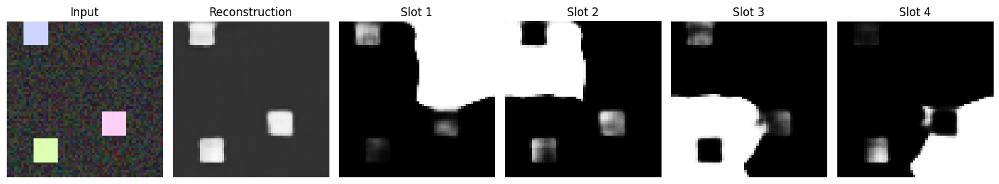
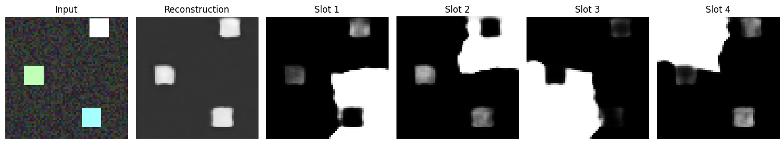
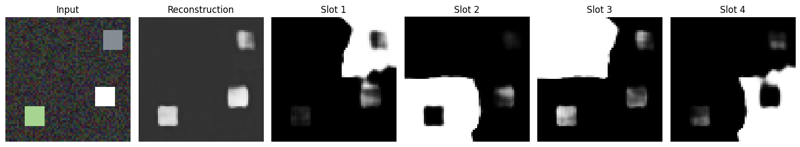

The mechanism of Attention, widely popularized by the advent of ChatGPT and subsequent Large Language Models is one of the most beautiful and elegant mechanisms that have revolutionized the world. Attention finds an effective way to find out the contextual representation of any token with respect to all tokens in that input sequence using the dot products of *Query, Key and Value* pairs. But wait, what if we take this mechanism, tweak it slightly and apply it to images? Well, that's how Slot Attention is born!

Slot Attention is an Unsupervised Object-Centric Representation Learning method that has the ability to divide an image into $K$ slots. It takes an image and iteratively crafts and builds slots that accurately represent the image using the objects that are present in that image. Here, slots could represent any object in an image, be it a cube or a sphere or any other arbitrary object.

# Architecture

The slot attention model is defined by three individual components: Encoder, Slot Attention, Decoder.

## Encoder

The Encoder is a simple CNN Encoder which takes an image input $[B, H, W, 3]$  and converts it into a bunch of feature maps $[B, H, W, D]$  with $D$ channels, where $D$ is the number of dimensions of the slot vectors. 

This Encoder output though, does not have any sort of positional information. For example, even though we know that clouds usually appear in the sky and its reflection appears in a lake, our model has no way to know that and will see the clouds and the reflection the same way since it isn't informed about the positions of any pixel. 

To solve this, we build a grid of the same height and width of the Encoder output which has the coordinate information of each pixel and add this to the encoder output. Now we have the encoder output ready to perform Slot Attention on!

## Slot Attention

In traditional attention used in transformers and LLMs, attention is performed on all tokens with respect to all tokens and Softmax is applied on the input tokens itself.

In Slot Attention, we perform Softmax on the Slots instead of the input pixels. Why? That's because we want the Slots to compete over each individual pixel and not the other way round, which develops a form of competition where each slots competes over each pixel to be included in its vector representation. 

These slots would be of the shape $[B, K, D]$ where $B$ is the batch dimension, $K$ is the number of slots. These slots have to be initialized in such a way that they are sure to diverge and represent different entities in the image. Let's say that we initialize all the slots with the exact same values, in this situation, all the slots are initially representing the same thing. In this case, all of the dot products in attention would be the exact same for all the slots, leading to the same gradient updates, breaking the slot attention.

To fix this, we extract the slot vectors using learnable parameters of $\mu$ and $log(\sigma)$ and we add a noise term $\epsilon$ to this distribution $slot = \mu + \sigma.\epsilon$  to make sure that all slots are initialized with different initial values.

After initialization, the slots then perform attention where the slots are converted into $Q$ vectors and the input pixels are converted into $K$ and $V$ vectors. Then Attention is performed:
$$
Softmax_k(\frac{Q.K}{\sqrt{D}})
$$
We do this iteratively for $T$ iterations, where we pass the new updates to the slot vectors to a GRU Cell which does the heavy lifting of maintaining the state of slot vectors and any updates done to it to get the slots vectors and then we pass them into the decoder.

# Decoder

The decoder takes the slot vectors $[B, K, D]$ and converts them into an image of $[B\times K, H\_init, W\_init, D]$, where $H\_init$ and $W\_init$ are the initial dimension of the image passed into the decoder. Each slot will be made into an image of size $[H\_init, W\_init, D]$ and the decoder is basically a stack of ConvTranspose layers which upsample the initial input into an image of size $[H\_out, W\_out, 4]$, where the first 3 channels are the rgb channels of the image and the fourth channel's the mask of that slot. 

We now have an output of $[B*K, H\_out, W\_out, 4]$ and we separate this into $[B*K, H\_out, W\_out, 3]$ being the rgb image and $[B*K, H\_out, W\_out, 1]$ being the mask. We then apply a sigmoid over the rgb image of each slot since the intensity values must be between 0 and 1 and we apply softmax over the masks on the slot dimension so that the slots can compete over which is more relevant for that image reconstruction.

# Why use JAX?

Attention is a very expensive operation and training can get very tedious. Since I am learning JAX and also wanted to do this reimplementation project. I decided to combine both and code the reimplementation purely on JAX and Flax, which is a JAX-based Deep Learning library made by Google Deepmind. I have specifically used `jax.jit` on the `train_step` function which enforces Just-In-Time compilation to execute that function, making training much more efficient.

# Results

Initially I trained the model using a custom generated dataset which places colored blocks on a black background. This caused the reconstruction to be a plain black image. This behaviour occurred because the image contained mostly black pixels, and the MSE Loss used made the model follow the path of least resistance, leading to maximize the number of black pixels in the reconstruction, since the loss would be very low if the original input image contains mostly the black pixels and few chunks of other colored pixels in the image.

So instead I trained the model using a custom generated dataset which places colored blocks on slightly noisy gray background instead of a plain black background using $T=3$ and for 50000 steps with a batch size of 32 and using $D = 64$ .

These were the validation results:

As you can observe, the model has reconstructed the image to a good level of approximation along with the each of the slots representing different parts of the input image.

# References

[1] Francesco Locatello, et al."[Object-Centric Learning with Slot Attention](https://arxiv.org/abs/2006.15055)". Advances in Neural Information Processing Systems (2020).

[2] Google Research. "[slot_attention](https://github.com/google-research/google-research/tree/master/slot_attention)". GitHub repository (2020).

[3] Phil Wang. "[slot-attention](https://github.com/lucidrains/slot-attention)". GitHub repository (2020).
